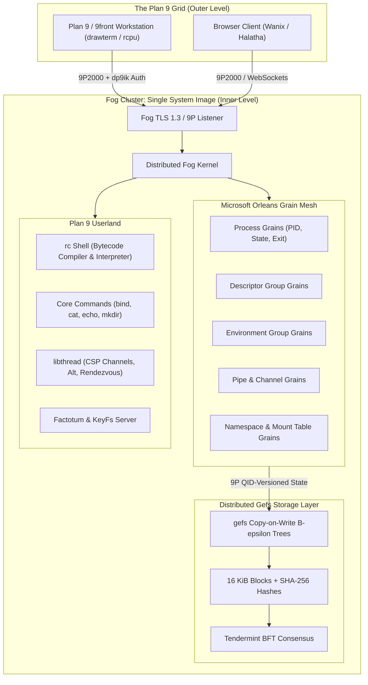

# Fog: Plan 9 on a Resilient Cluster

> **A distributed, fault-tolerant operating system runtime bringing the Plan 9 philosophy to multi-machine clusters.**  
> Built in C# on .NET 10 using **Microsoft Orleans** virtual actors, **9front gefs** copy-on-write $B^\varepsilon$-tree storage, **Tendermint** BFT consensus, and strict **9P2000** protocols.

---

## 🌫️ Overview

**Fog** reimagines Plan 9 for modern, resilient infrastructure. Instead of treating each machine as an isolated node with its own process table and kernel, a Fog cluster acts as a **Single System Image (SSI)**:

* **Inside a cluster: one system image.** Each machine runs a Fog silo. Microsoft Orleans membership joins the silos into an elastic cluster. The cluster executes a distributed Plan 9 kernel: a unified PID space, process state and descriptors hosted in virtual actor grains, workload placement decided dynamically at `rfork`, and automatic recovery from grain state when a node dies. To any process or shell, the entire cluster feels like a single Plan 9 machine.
* **Between clusters: a classic Plan 9 grid.** The cluster exposes standard 9P2000 services to the outside world. Outside machines—whether other Fog clusters, native 9front workstations, or browser clients—attach over 9P, authenticate with `dp9ik` against the cluster's auth server, and mount namespaces under `/n/{cluster}`.

---

## 🏛️ High-Level Architecture



---

## 🧩 Solution Map & Projects

Fog is structured into clean, modular projects under `Fog.sln`:

| Project | Description | Key Components |
| :--- | :--- | :--- |
| [`NinePSharp.Fog`](NinePSharp.Fog/) | Core transactional engine & control plane | `FogTransactionStore`, `FogAtomicPlan`, `FogCommitPlan`, `FogControlFile`, LibTab records |
| [`NinePSharp.Fog.Kernel`](NinePSharp.Fog.Kernel/) | Distributed Plan 9 kernel emulation | `Process`, `FogKernel`, `RforkFlags`, syscalls (`rfork`, `exec`, `mount`, `bind`), devices (`#c`, `#\|`, `#d`, `#p`, `RamFs`) |
| [`NinePSharp.Fog.Gefs`](NinePSharp.Fog.Gefs/) | C# port of 9front's `gefs(4)` filesystem | Copy-on-write $B^\varepsilon$-tree (`Tree`), `Allocator`, `Arena`, `Superblock`, `Deadlist`, `GefsFs`, 9P server |
| [`NinePSharp.Fog.Namespaces`](NinePSharp.Fog.Namespaces/) | Distributed namespaces via Orleans | `FogRootGrain`, `FogSharedRoot`, `FogAuthorizationAuthority`, `FogNamespaceAttachResolver` |
| [`NinePSharp.Fog.Rc`](NinePSharp.Fog.Rc/) | C# port of Plan 9's `rc` shell | `RcCompiler`, `RcParser`, `RcLexer`, `RcShell`, `RcProgram`, `RcThread`, AST, bytecode engine |
| [`NinePSharp.Fog.Thread`](NinePSharp.Fog.Thread/) | C# port of Plan 9's `libthread(2)` | `Channel<T>`, `Alt<T>`, `Rendezvous`, CSP synchronization primitives |
| [`NinePSharp.Fog.Auth`](NinePSharp.Fog.Auth/) | Authentication & Factotum infrastructure | `P9anyServer`, `KeyFsHost`, `KeyDatabase`, `StorageKeySeal` (TPM 2.0), `SpeaksForRule` |
| [`NinePSharp.Fog.Server`](NinePSharp.Fog.Server/) | 9P server dispatcher & TLS listeners | `FogNinePDispatcher`, `FogTransactionFileTree`, `FogTlsClient`, `FogNodePolicy`, node enrollment |
| [`NinePSharp.Fog.Commands`](NinePSharp.Fog.Commands/) | Standard Plan 9 command utilities | `bind`, `cat`, `echo`, `mkdir` implementations for kernel execution |
| [`NinePSharp.Fog.Fuzzer`](NinePSharp.Fog.Fuzzer/) | Security & input resilience fuzzing | SharpFuzz / AFL harnesses for record codecs, files, and dispatcher limits |

---

## ⚡ Core Concepts

### 1. Two Levels of Distribution
* **Intra-Cluster:** Orleans virtual actors manage process execution, file descriptors, and namespace state across machines. If an individual machine crashes, Orleans resurrects its grains on surviving silos from durable storage.
* **Inter-Cluster:** Standard Plan 9 networking. A Fog cluster speaks pure 9P2000. Any standard 9front kernel or user can connect using `rcpu`, `drawterm`, or `mount`.

### 2. "Everything That is Not the Kernel is a Process"
In Fog, the kernel handles process lifecycle, namespace binding, descriptor tables, and system calls. Everything else—including the `rc` shell, file servers, `keyfs`, `authsrv`, transaction coordinators, and WASM applications—runs as a process. A server is simply a program that a process `exec`s, interacting with the system through standard file descriptors and its per-process namespace.

### 3. Distributed Storage is a 9P File Server (Gefs)
Fog contains **no SQL database**. All durable state (namespaces, process metadata, Orleans grain state, application save files) is stored in a replicated 9P file server powered by a native port of 9front's **gefs**:
* **$B^\varepsilon$-Tree Architecture:** Copy-on-write trees that absorb upserts, split/merge nodes, and commit atomically at superblock write boundaries.
* **Content-Addressed Blocks:** 16 KiB blocks verified via SHA-256 hashes. If a block is corrupt, it is fetched peer-to-peer and repaired automatically.
* **Tendermint Consensus:** Replicas use a C# port of Tendermint BFT consensus to agree on the current committed root hash and generation ($2f + 1$ quorum).

---

## 🛡️ Testing & Formal Verification

Fog adheres to an exhaustive, multi-tier quality gate with **over 1,600 verified tests**:

* **Behavior-Driven Development (BDD):** Human-readable, executable specifications written in Gherkin (`.feature` files) and tested via **Reqnroll / xUnit**.
* **Deterministic Concurrency Testing (Microsoft Coyote):** Concurrency exploration (`NinePSharp.Fog.Coyote.Tests`) systematic reordering of thread interleavings to uncover race conditions, deadlocks, and memory leaks.
* **Mutation Testing (Stryker .NET):** Strict mutation score thresholds (**90% to 100%**) across every core subsystem to ensure test suites kill mutants rather than merely covering lines.
* **Input Fuzzing:** Continuous fuzz campaigns using SharpFuzz and AFL across record parsing and 9P wire formats.

---

## 🚀 Getting Started

### Prerequisites
* [.NET 10 SDK](https://dotnet.microsoft.com/)
* Linux, macOS, or Windows
* Python 3 (for quality and coverage tools)

### Building the Solution
```sh
# Clone the repository
git clone https://github.com/rentonsoftworks/Fog.git
cd Fog

# Restore dependencies and build in Release mode
dotnet build Fog.sln -c Release
```

### Running Test Suites
```sh
# Run core transaction tests
dotnet test NinePSharp.Fog.Tests/NinePSharp.Fog.Tests.csproj

# Run kernel syscall & device tests
dotnet test NinePSharp.Fog.Kernel.Tests/NinePSharp.Fog.Kernel.Tests.csproj

# Run rc shell compiler & execution tests
dotnet test NinePSharp.Fog.Rc.Tests/NinePSharp.Fog.Rc.Tests.csproj

# Run Gefs filesystem tests
dotnet test NinePSharp.Fog.Gefs.Tests/NinePSharp.Fog.Gefs.Tests.csproj

# Run libthread channel tests
dotnet test NinePSharp.Fog.Thread.Tests/NinePSharp.Fog.Thread.Tests.csproj

# Run authentication & keyfs tests
dotnet test NinePSharp.Fog.Auth.Tests/NinePSharp.Fog.Auth.Tests.csproj
```

### Running the Full Quality Gate
```sh
# Standard gate: build, unit tests, code coverage, and CRAP analysis
bash scripts/run-quality.sh

# Complete gate: includes mutation testing, Coyote interleavings, and fuzzing
bash scripts/run-quality.sh --full
```

---

## 📚 Deep-Dive Documentation

For detailed technical references, explore the companion documentation in the `docs/` directory:

* 📐 [**System Architecture & Failure Model**](docs/ARCHITECTURE.md) — Two-level design, grain-process lifecycle, placement, and failure domains.
* 📦 [**Subsystems Deep Dive**](docs/SUBSYSTEMS.md) — Detailed breakdown of every project, class structure, and interface.
* 💾 [**Gefs Storage & Consensus**](docs/STORAGE_GEFS.md) — $B^\varepsilon$-tree layout, SHA-256 block verification, arenas, and Tendermint replication.
* 🐚 [**Kernel, Rc Shell & Userland**](docs/KERNEL_AND_USERLAND.md) — Syscalls (`rfork`), devices (`#c`, `#\|`), the `rc` bytecode compiler, and `libthread`.
* 🧪 [**Verification & Quality Engineering**](docs/VERIFICATION_AND_QUALITY.md) — BDD features, Coyote concurrency exploration, and Stryker mutation gates.
